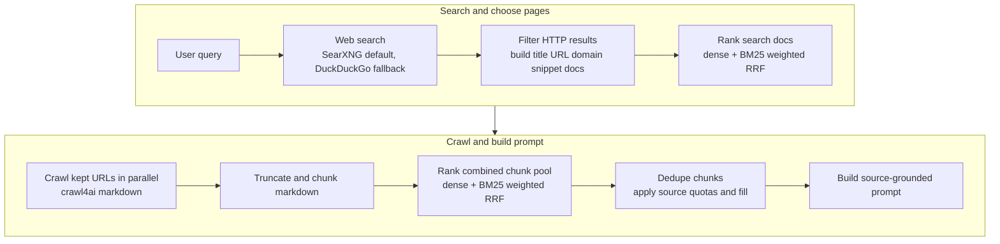

# TinySearch

> [!NOTE]
> TinySearch now defaults to a SearXNG-compatible search backend, with the
> existing DuckDuckGo HTML scraper kept as a configurable fallback. The bundled
> `compose.yaml` ships a local SearXNG service so the stack works out of the
> box. See [Search backends](#search-backends) for configuration.

<p align="center">
  
</p>

[](LICENSE)
[](https://github.com/MarcellM01/TinySearch/releases)
[](https://github.com/MarcellM01/TinySearch/commits/main)
[](https://hub.docker.com/r/marcellm01/tinysearch)
[](https://discord.gg/NG6u2zamR)


A tiny local-first web research engine for MCP agents.

TinySearch searches the web, reranks results, crawls the best pages, extracts
the most relevant chunks, and returns a source-grounded prompt your LLM can
answer from.

<p align="center">
  
</p>

No hosted dashboard. No account system. No analytics. No scraped-data cache.

Just search -> crawl -> rerank -> grounded prompt.

## Quick start

Run TinySearch with its own SearXNG instance as an MCP server over Streamable
HTTP. Docker Compose loads the configuration directly from GitHub, so you do
not need to clone the repository or create any configuration files:

```bash
docker compose -f "https://github.com/MarcellM01/TinySearch.git#main:compose.quickstart.yaml" up -d
```

Then connect your MCP client to:

```json
{
  "mcpServers": {
    "tinysearch": {
      "url": "http://localhost:8000/mcp"
    }
  }
}
```

Stop and remove the containers later with:

```bash
docker compose -f "https://github.com/MarcellM01/TinySearch.git#main:compose.quickstart.yaml" down
```

TinySearch exposes two MCP tools:

```text
research(query)
scrape_url(url, query, max_tokens=4000)
```

Pass the user's question as-is. `research` searches, crawls, reranks, and
returns the grounded prompt in `answer`. `scrape_url` inspects a specific URL
the caller already knows, applies the same ranking and token budget, and
returns the grounded prompt in `answer`.

## Community

The TinySearch Discord is now live ✨

Join the [TinySearch Discord](https://discord.gg/NG6u2zamR) for support, release updates, bug reports, and contributor discussion.

## Why TinySearch?

- Give local agents web research without wiring together a whole search stack.
- Keep source URLs attached to the evidence your model sees.
- Avoid dumping full webpages into context.
- Use local ONNX embeddings or an OpenAI-compatible embedding API.
- Run over MCP or a simple FastAPI endpoint.

TinySearch is built for local agents, prototypes, personal workflows, and small
systems where source-grounded web research matters more than running a full
search backend.

## How it works



TinySearch does not directly answer the question. It returns a
**structured prompt** in the MCP tool's **`answer` field**, and your
**client model** uses that prompt to produce the final **cited response**.

```text
QUESTION
What happened in the latest NFL playoffs?

TODAY
2026-05-15

RESULTS
1. Title
   URL
   Relevant extracted text...

2. Title
   URL
   Relevant extracted text...

INSTRUCTIONS
Answer only from the results. Cite source URLs.
```

## Run from source

Use this path if you want to inspect the code, edit TinySearch, or run it as a
local stdio MCP server.

```bash
git clone https://github.com/MarcellM01/TinySearch
cd TinySearch

python -m venv .venv
source .venv/bin/activate
pip install -r requirements.txt
```

MCP clients spawn TinySearch from their config. Add it with absolute paths:

macOS / Linux:

```json
{
  "mcpServers": {
    "tinysearch": {
      "command": "/absolute/path/to/TinySearch/.venv/bin/python",
      "args": [
        "/absolute/path/to/TinySearch/servers/mcp_server.py"
      ]
    }
  }
}
```

Windows:

```json
{
  "mcpServers": {
    "tinysearch": {
      "command": "C:/absolute/path/to/TinySearch/.venv/Scripts/python.exe",
      "args": [
        "C:/absolute/path/to/TinySearch/servers/mcp_server.py"
      ]
    }
  }
}
```

Template config files live in `mcp_templates/`.

The repo also includes [`agentic_coding_templates/global-rules-recommended.md`](agentic_coding_templates/global-rules-recommended.md),
a global-rules template for agentic coding tools such as Cline and Roo Code.
These rules help coding agents call TinySearch only when web research is
actually needed.

The server uses **stdio** by default, which is what Cursor and similar clients
expect when they spawn `python .../mcp_server.py`. To run with `sse` or
`streamable-http`, set `MCP_TRANSPORT` when starting the process. Do not put
transport in `configs/research_config.json`.

## Docker

The [quick start](#quick-start) command runs TinySearch over Streamable HTTP on
`http://localhost:8000/mcp`. Docker pulls `marcellm01/tinysearch:latest`
automatically if the image is not already local.

With `MCP_TRANSPORT=streamable-http`, the image serves Streamable HTTP on
`/mcp` and SSE on `/mcp/sse`. GET requests to `/mcp` without an
`mcp-session-id` are treated as the legacy SSE stream. If a client still cannot
connect, try `MCP_TRANSPORT=sse` alone or the stdio Docker setup below.

### Docker image tags

Docker images are published automatically when a version tag or GitHub release is created.

- `marcellm01/tinysearch:<version>` is published for tags such as `v0.1.4`.
- `marcellm01/tinysearch:latest` is updated for stable releases.
- Images are built for both `linux/amd64` and `linux/arm64`.
### Persistent models and config

For repeated use, keep downloaded models in a Docker volume and mount your local
config. The mounted config can also include `blocked_domains` to exclude sites
from search results:

```bash
docker run --rm \
  -p 8000:8000 \
  -v tinysearch-models:/data/models \
  -v "$PWD/configs/research_config.json:/config/research_config.json:ro" \
  -e TINYSEARCH_CONFIG_PATH=/config/research_config.json \
  -e MCP_TRANSPORT=streamable-http \
  -e MCP_HOST=0.0.0.0 \
  marcellm01/tinysearch:latest
```

Example config entry:

```json
"blocked_domains": ["example.com", "spammy-site.test"]
```

### MCP over stdio

Use this mode for MCP clients that launch tools as local commands instead of
connecting to a URL. Replace `/absolute/path/to/TinySearch` with this repo's
absolute path:

```json
{
  "mcpServers": {
    "tinysearch": {
      "command": "docker",
      "args": [
        "run",
        "--rm",
        "-i",
        "-v",
        "tinysearch-models:/data/models",
        "-v",
        "/absolute/path/to/TinySearch/configs/research_config.json:/config/research_config.json:ro",
        "-e",
        "TINYSEARCH_CONFIG_PATH=/config/research_config.json",
        "-e",
        "TINYSEARCH_MODELS_DIR=/data/models",
        "marcellm01/tinysearch:latest"
      ]
    }
  }
}
```

Edit `configs/research_config.json` to choose `embedding_model` (`fast`,
`balanced`, `quality`, or a custom Hugging Face ONNX repo id). The named Docker
volume keeps downloaded model bundles between launches.

## Optional HTTP server

Useful when you want HTTP instead of MCP:

```bash
uvicorn servers.fastapi_server:app --reload
```

Endpoints:

- `GET /health`
- `GET /web_search?query=...`
- `POST /site_crawl`
- `POST /scrape`
- `POST /research`

`POST /scrape` accepts a JSON body with `url` (required), `query` (required,
non-empty), `max_tokens` (optional, default 4000) and `include_metadata`
(optional, default true). The response includes a `URL-GROUNDED ANSWER PROMPT`
in `answer`, plus `content_tokens`, `answer_tokens`, `truncated`, `url`,
`title`, `retrieved_at` (aware UTC) and best-effort `metadata`
(`description`, `author`, `published_date`).

Errors return `{"detail": {"code", "message"}}` with stable codes:
`invalid_url` (400), `blocked_url` (403), `unsupported_document` (415),
`empty_content` (422), `fetch_failed` (502), `fetch_timeout` (504).

### URL safety

`/scrape` and `scrape_url` accept arbitrary user-supplied URLs and enforce
the following checks before fetching:

- only `http` and `https` schemes
- URLs with embedded credentials are rejected
- IP literals and resolved addresses that are loopback, private, link-local,
  multicast, reserved or unspecified are rejected (DNS rebinding is mitigated
  by rejecting if **any** resolved address is non-public, not just one)
- the configured `blocked_domains` list is applied to both the initial URL
  and the final URL reported by the crawler after redirects

Crawl4AI does not expose intermediate redirect hops, so the safety check runs
on the initial URL and the final URL. If you need stricter handling for
redirect chains, run TinySearch behind an egress proxy that enforces your
policy.

## Configuration

Tune research defaults in `configs/research_config.json`. Set
`TINYSEARCH_CONFIG_PATH` to load a different JSON config file, which is the
recommended Docker override pattern.

Set `blocked_domains` to a JSON list of domains you do not want TinySearch to
return or crawl. Entries match the domain and its subdomains, so `example.com`
also blocks `www.example.com` and `news.example.com`. URL-style entries such as
`https://example.com/path` are accepted and normalized to their hostname.

The `onnx` embedding backend uses local ONNX bundles under `models/`. Starting
the MCP server or FastAPI app downloads the configured `embedding_model` once
from Hugging Face when `embedding_backend` is `onnx`.

Built-in local presets:

- `fast`: `onnx-models/all-MiniLM-L6-v2-onnx`
- `balanced`: `BAAI/bge-small-en-v1.5`
- `quality`: `BAAI/bge-base-en-v1.5`

You can also set `embedding_model` to a custom Hugging Face ONNX repo id. Set
`TINYSEARCH_MODELS_DIR` to move the model cache, or use
`TINYSEARCH_ONNX_MODEL_DIR` when you need to point at one exact bundle directory.

Key settings:

- Search: `search_top_k`, `search_rrf_cutoff`, `search_dense_weight`, `search_max_results_to_keep`, `blocked_domains`
- Search backend: `search_backend`, `search_backend_url`, `search_engines`, `search_region`, `search_backend_fallback`
- Chunks: `chunk_rrf_cutoff`, `chunk_dense_weight`, `chunk_max_results_to_keep`
- Crawl: `crawl_max_chunk_tokens`, `crawl_overlap_tokens`, `max_concurrent_crawls`
- Embeddings: `embedding_backend`, `embedding_model`, `embedding_openai_env_file`, `max_concurrent_embedding_calls`
- Tokenizer: `encoding_name`
- Dense input prefixes: `dense_query_prefix`, `dense_document_prefix`
- Trace: `trace_path`

For `embedding_backend` `openai_compatible`, add a `.env` file at the project
root, or set `embedding_openai_env_file`, with:

```text
OPENAI_BASE_URL=
OPENAI_API_KEY=
OPENAI_EMBEDDING_MODEL=
```

`OPENAI_BASE_URL` is optional for api.openai.com. `EMBEDDING_MODEL` and
`MODEL_NAME` are accepted as aliases for `OPENAI_EMBEDDING_MODEL`.

The research pipeline requires dense embeddings. It raises if
`search_dense_weight` or `chunk_dense_weight` is set to `0`.

## Search backends

TinySearch supports two web-search backends and selects between them from
config. The defaults aim at the bundled compose setup: SearXNG runs as a
sidecar, with the DuckDuckGo HTML scraper kept as an automatic fallback.

Available values for `search_backend`:

- `"searxng"` (default): query a SearXNG-compatible JSON endpoint. If the call
  fails and `search_backend_fallback` is `true`, TinySearch falls back to
  DuckDuckGo. With `search_backend_fallback: false` the SearXNG error surfaces.
- `"duckduckgo"`: skip SearXNG entirely and use the existing DuckDuckGo HTML
  scraper. This is the escape hatch that preserves pre-0.2 behavior.
- `"auto"`: try SearXNG, then DuckDuckGo on any backend failure (fallback
  is implied regardless of `search_backend_fallback`).

A backend "failure" means a real backend error: network/timeout, non-200 HTTP
response, a non-JSON SearXNG body, or a DuckDuckGo CAPTCHA / 403. A legitimate
empty result set is **not** a failure and does not trigger fallback.

Minimal config example:

```json
{
  "search_backend": "searxng",
  "search_backend_url": "http://searxng:8080/search",
  "search_engines": ["google", "bing"],
  "search_region": "us-en",
  "search_backend_fallback": true
}
```

### SearXNG JSON output is required

SearXNG ships with the JSON output format **disabled** by default. The bundled
`searxng/settings.yml` enables it via:

```yaml
search:
  formats:
    - html
    - json
```

If TinySearch reports `SearchBackendUnavailable: SearXNG did not return JSON`,
your SearXNG instance is returning HTML — add `json` to `search.formats` and
restart it.

### Environment overrides

- `SEARXNG_URL`: overrides `search_backend_url` for the running process. Useful
  in Docker so the same image can point at different SearXNG endpoints without
  rebuilding `research_config.json`.

### Compose setup

The bundled `compose.yaml` starts a `searxng` service alongside `mcp` (and
optionally `fastapi`). The `mcp` and `fastapi` services reach SearXNG at
`http://searxng:8080/search` over the internal compose network, and have
`SEARXNG_URL` set automatically.

```bash
docker compose up
```

A minimal `searxng/settings.yml` is committed at the repo root. Override
`server.secret_key` before exposing the SearXNG instance beyond localhost.

### Single-container / from-source

When you run TinySearch standalone (e.g. `docker run marcellm01/tinysearch:latest`
or `python servers/mcp_server.py`), there is no local SearXNG. With the default
config (`search_backend: "searxng"`, `search_backend_fallback: true`) the
SearXNG call fails fast on the short connect timeout and TinySearch
transparently falls back to DuckDuckGo.

To keep the pre-0.2 behavior with no SearXNG involvement, set:

```json
{ "search_backend": "duckduckgo" }
```

## When not to use TinySearch

TinySearch is not a replacement for a commercial search API or a persistent
crawler. It is probably not the right tool if you need:

- guaranteed search coverage
- large-scale indexing
- long-term page caching
- enterprise observability
- production SLA-backed web search

## TinySearch vs...

| Tool type | What it gives you | Tradeoff |
| --- | --- | --- |
| Search API | Search results | Usually hosted / paid |
| Full crawler / index | Persistent search backend | More infrastructure |
| SearxNG | Metasearch | Still needs setup and a ranking layer |
| **TinySearch** | MCP research prompt with ranked chunks | Lightweight; not a full search engine |

## Entrypoints

- `pipelines.agentic_research.agentic_run`: single-turn search, crawl, ranking, and prompt assembly
- `servers.mcp_server`: MCP server for agent clients
- `servers.fastapi_server`: optional HTTP API

## Tests

Run the unittest suite:

```bash
python -m unittest discover tests
```

## Contact

Using TinySearch or want to build on it?

[Email me](mailto:hello.marcbuilds@gmail.com) or reach me on [Bluesky](https://bsky.app/profile/marcellm01.bsky.social).

## Privacy notes

TinySearch reads the pages it crawls and returns ranked excerpts to the calling
client. It does not include credentials in the repo, and `.env` / trace output
should stay local. If you enable `openai_compatible` embeddings, your embedding
provider receives the text snippets sent for vectorization.

## License

Source code in this repository is under the [MIT License](LICENSE).

When `embedding_backend` is `onnx`, TinySearch may download the selected local
ONNX embedding bundle at runtime from Hugging Face. Those weights are separate
distributions under their model-card licenses; keep license and attribution
notices if you ship or redistribute those files. Optional manual export for
`fast` uses `sentence-transformers/all-MiniLM-L6-v2` (Apache-2.0).

See [NOTICE](NOTICE) for Docker and third-party distribution notes.
